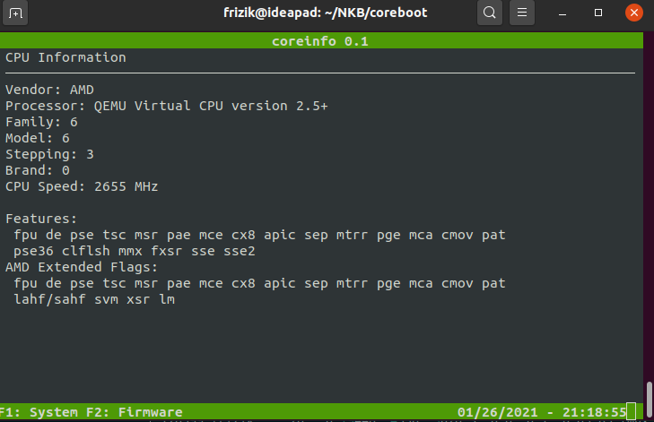
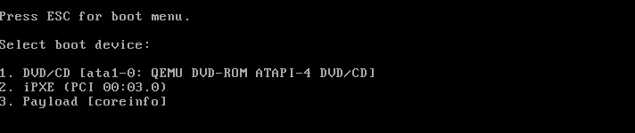
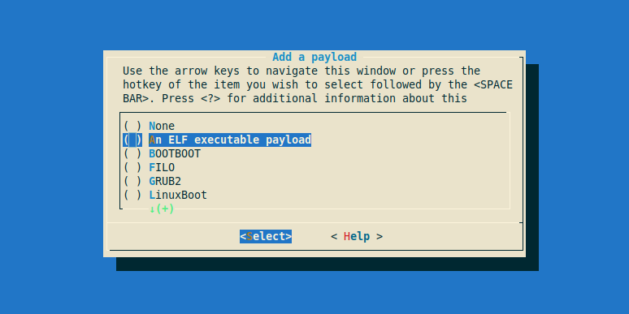
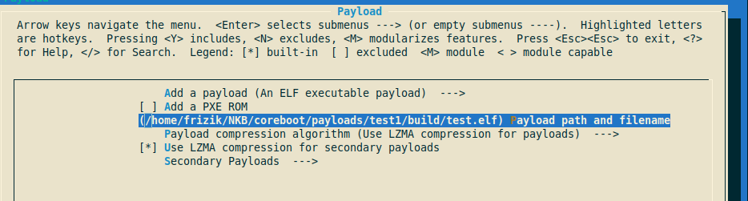
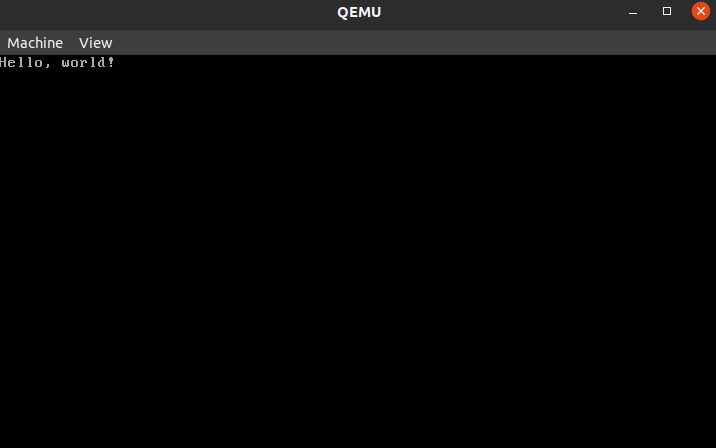
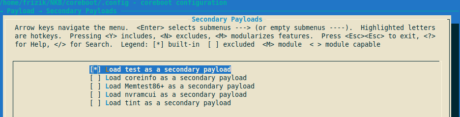
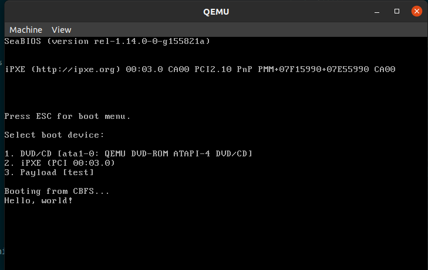

# Конфигуратор на основе Coreboot
Промежуточный отчёт по проделанной работе 03.02.2021

## Шаг I. Установка QEMU
Для отладки созданного конфигуратора будет использоваться виртуальная машина, запущенная на Qemu. Для установки **QEMU** необходимо выполнить следующую команду: 
```
sudo apt install qemu-kvm qemu
```

## Шаг II. Сборка и настрйока тестого образа coreboot + coreinfo
Установим необходимые библиотеки и утилиты для сборки и скопируем **coreboot** из репозитория: 

```
sudo apt-get install -y bison build-essential curl flex git gnat-5 libncurses5-dev m4 zlib1g-dev
git clone https://review.coreboot.org/coreboot
cd coreboot
```
Далее необходимо сбрать утилиты coreboot и полезную нагрузку(payload), утилиту Coreinfo, она нужна для вывода информации о системе (CPU, PCI и тд).

```
make crossgcc-i386 CPUS=$(nproc)
make -C payloads/coreinfo olddefconfig
make -C payloads/coreinfo
```
Теперь сконфигурируем mainboard, для этого выполним команду:
```
make menuconfig
```
Нужно убедится что мы собираем coreboot под виртуальную машину QEMU, для этого во вкладке Mainboard, следует убедится что в меню **Mainboard**:
1. В пункте **Vendor** указан параметр - **Emulation**
2. В пункте **Model** узазанно значение - **QEMU x86 i440fx/piix4**
3. В меню payload выбрать пункт **An Elf executable payload** и указать путь к elf файлу **payloads/coreinfo/build/coreinfo.elf**
4. Выйти из конфигуратора, сохранив введённые изменения

Собираем образ coreboot и запускаем его в QEMU:
``` 
make  
qemu-system-x86_64 -bios build/coreboot.rom 
```


## Шаг III. Добавление SeaBIOS и второй "полезной нагрузки" - nvramcui
Снова используем **make menuconfig**, и аналогично меняем payload с Coreinfo на **SeaBIOS**, так же в пункте **Second Payloud** выбираем, **nvramcui**. Теперь при выборе загрузочного диска есть возможность включить nvramcui, на базе которого будет писаться наш конфигуратор. Аналогично как и в шаге II собираем coreboot. Результат: 


## Шаг IV. Библиотека ncurses
Для более глубокого понимания того как работает ncurses был просмотрен цикл роликов на youtube и написанно несколько тестовых программ с реализацией многовариантного меню.
1. Все написанные исходники хранятся в папке ncurses   
2. Плейлист с гайдами: [](https://youtu.be/lV-OPQhPvSM)
3. Итоговый гуй я ещё не нарисовал, в ближайшее время сделаю
  

## Шаг IV. Добавление собственных payload-ов
Исходный код тестового самодельного payload:
```
#include <libpayload.h> // библиотека необходимая для всех payloud
 
int main(void)
{
    printf("Hello, world!\n"); 
    halt();
    return 0;
}
```
Описание в Makefile:
```
unexport $(COREBOOT_EXPORTS)

ARCH = x86_32
OBJS = $(obj)/test.o
TARGET = $(obj)/test.elf

all: real-all

include ../libpayload/Makefile.payload

real-all: $(TARGET)

.PHONY: all real-all

```
### Добавление первчиных payloads
Для добавление первичного payloud достаточно при вызове ```make menuconfig``` указать в качестве **payloud** путь к необходимому **.elf** файлу.


После этого сохраняем изменения и собираем командой ```make```. В результате при запуске qemu мы должны увидеть следующее:

### Добавление вторичных payloads
Для добавления вторичных payloud необходимо внести ряд изменений в файлы Makefile.inc и Kconfig, лежащих в папке payloads. Далее приведены добавленные описания в этих файлах:

1. Makefile.inc
```
cbfs-files-$(CONFIG_TEST_SECONDARY_PAYLOAD) += img/test
img/test-file := payloads/test/build/test.elf
img/test-type := payload
img/test-compression := $(CBFS_SECONDARY_PAYLOAD_COMPRESS_FLAG)

payloads/test \

payloads/test/build/test.elf test: export CCACHE := $(CCACHE)
payloads/test/build/test.elf test: force-payload
	$(MAKE) -C payloads/test

```
2. Kconfig

```
config TEST_SECONDARY_PAYLOAD
	bool "Load test as a secondary payload"
	default n
	depends on ARCH_X86
	help
	  test can be loaded as a secondary payload under SeaBIOS, GRUB,
	  or any other payload that can load additional payloads.
```

Теперь в make menuconfig можно установить тестовый payloud в качестве "второго".

В качестве "первого" укажем SeaBIOS. Итоговый результат после сборки:


## Шаг V. Изучение принципов работы bayou и nvramcui
Сейчас я работаю над разбором комментированием исходного кода nvramcui и bayou. Что понял и какие есть вопросы:
1. Тут происходит выгрузка данных из CMOS. 
    ```
    lib_get_sysinfo(); // Функция из payloads/libpayload/arch/i386/sysinfo.c. Получает информацию из coreboot tables, если они существуют (ret = get_coreboot_info(&lib_sysinfo);)

	struct cb_cmos_option_table *opttbl = get_system_option_table();//Загружается таблица системных настроек

	if (opttbl == NULL) {
		printf("Could not find coreboot option table.\n");
		halt();
	} // Если их нет то всё, иначе готовим структуру *option к выгрузке параметров из таблиц

	/* prep CMOS layout into libcurses data structures */

	struct cb_cmos_entries *option = first_cmos_entry(opttbl);
	int numopts = 0;
	int maxlength = 0;

    // После выгружки параметров пересчитываем их и находим самый длинный по названию параметр, я так понял, чтобы корректно рисовать ncurses-ом GUI.

	count_cmos_options(option, &numopts, &maxlength);
    ```
2. Далее проихсодит настройка цветов и создание окон для ncurses, после чего следует блок кода, отвечающий за "перекрашивание" элемента меню при наведении "курсора", а так же за вывод других значений выбранного параметра (перелистывание параметров при нажатии на стрелки)
    ```
    done = 0;
        while (!done) {
            render_form(form);
            ch = getch(); // ловим нажатую пользователем клавишу
            if (ch == ERR) 
                continue;
            switch (ch) {
            case KEY_DOWN:
                form_driver(form, REQ_NEXT_FIELD);
                break;
            case KEY_UP:
                form_driver(form, REQ_PREV_FIELD);
                break;
            case KEY_LEFT:
                if (field_type(current_field(form)) == TYPE_ENUM) {
                    form_driver(form, REQ_PREV_CHOICE);
                } else {
                    form_driver(form, REQ_LEFT_CHAR);
                }
                break;
            case KEY_RIGHT:
                if (field_type(current_field(form)) == TYPE_ENUM) {
                    form_driver(form, REQ_NEXT_CHOICE);
                } else {
                    form_driver(form, REQ_RIGHT_CHAR);
                }
                break;
            case KEY_BACKSPACE:
            case '\b':
                form_driver(form, REQ_DEL_PREV);
                break;
            case KEY_DC:
                form_driver(form, REQ_DEL_CHAR);
                break;
            case KEY_F(1):
                done = 1;
                break;
            default:
                form_driver(form, ch);
                break;
            }
        }
    ```
    Для управления полями меню используется функция form_driver(форма, передаваемый параметр/флаг)
3. Не до конца понимаю что происходит вот тут, модификация полей меню, но что-то как-то хитро немного. 
    ```
	for (i = 0; i < numopts; i++) {
		char *name = field_buffer(fields[2 * i], 0);
		char *value = field_buffer(fields[2 * i + 1], 0);
		char *ptr;
		for (ptr = value + strlen(value) - 1;
		     ptr >= value && *ptr == ' '; ptr--)
			;
		ptr[1] = '\0';
		set_option_from_string(use_nvram, opttbl, value, name);
	}
    ```
4. Из последних версий coreboot из дефолтной поставки, видимо, выпилили **bayou**, поэтому для работы с ним нужно скачать более старую версию coreboot с этой страницы - https://www.coreboot.org/downloads.html. По сути bayou ничгео не умеет, кроме запуска "спаршенных" payload-ов из CBFS, но в тонкостях того как он это делает я ещё не разобрался до конца, думаю через 2-3 дня разберусь точно.

5. У меня есть вопрос что такое BootMedium, гугл ничего не говорит, wiki по coreboot такого определения тоже не знает, поэтому я не могу понять что это.

6. Какой итоговый конфигуратор должен получится? Я так понимаю, что он должен уметь редактирвоать параметры из nvramcui, иметь возможность загружать после себя дополнительные payload, как bayou, а так же устанавливать порядок загрузки жёстких дисков(или не дисков, или не жёстких), я правильно всё понимаю?  


Поменять tinyCurses на mdСurses (лоховской на поцанский)

seabios -> post.c -> maininit -> interactive_bootmenu();
coreinfo -> coreinfo.c -> print_submenu();
pci_moudle -> Пример корректной работы форм


15.04.2021
1. home/vxuser/coreboot/payloads/external/SeaBIOS/seabios/src/post.c maininit(void) -> interface_init()

2. interface_init(void) -> boot_init();

3. home/vxuser/coreboot/payloads/external/SeaBIOS/seabios/src/boot.c boot_init(void) -> loadBoorOrder()

4. loadBootOrder - загружает bootmedium

5. Для нахождения доступных методов загрузки нужно смотреть лог запуска SeaBios, в частности строки Searching Bootorder for <pci@.....>

6. Включение отладки для получения этого лога
    ```
    sudo apt install python3-pip
    pip3 install pyserial
    sudo readserial.py /dev/ttyS0 115200
    mkfifo qemudebugpipe
    make menuconfig # debug -> debug_level = 8

    qemu -chardev pipe,path=qemudebugpipe,id=seabios -device isa-debugcon,iobase=0x402,chardev=seabios ...
    qemu-system-x86_64 -bios build/coreboot.rom

    ./readserial.py -nf qemudebugpipe
    ```


29.04.2021
1. План поменялся, никакие отладчики не будем юзать, они конченные. Отлаживать с помощью какого-нибудь флопика, надо его добавить

2. Редактировать будем cmos.layout, там нужно описать состояния и зарезервировать место для хранения параметров в cmos.

3. Редактировать будем файл /home/vxuser/coreboot/payloads/external/SeaBIOS/seabios/src/boot.c 

4. В функции interactive_bootmenu(void) нужно убрать отображение вариантов загрузки, оставив только функцию входа в конфигурационное меню и подпись, с какого сейчас мы грузимся устройства.

5. Сейчас нужно плюнуть что-то в CMOS из конфигуратора и поймать это из сибиоса и через printf вывести.

6. cb_cmos_entries в файле payloads/libpayload/include/coreboot_tables.h

7. Для cmos.layout  **(700     20  r   1   boot_medium)**. Если добавить эти строки в cmos.layout, то вылетает ошибка Unaligned CMOS option table entry boot_medium spans multiple bytes. src/arch/x86/Makefile.inc:25: recipe for target 'build/option_table.h' failed


03.06.2021
1. Работа с параметрами CMOS
```
  static int cmos_write_test(struct cb_cmos_entries *option)
  {
    // Вывели прочитанное из cmos
    printf("Name of option: %s\nStart bit: %d\n",option->name, option->bit); // Вывод старотового бита
    printf("Value:%d",option->size);	
    return 0;
  }
```

2. В coreboot_tables.h описанны структуры, меня интересует сb_cmos_entries, нужно как-то запистаь в эту структуру значения и после считать их. Путь: payloads/libpayload/include/coreboot_tables.h

3. По пути payloads/libpayloads/drivers/options.c в функции int set_option_from_string() происходит запись параметров из конфигуратора в CMOS. В nvramcui.c и nvram_module.c эта функции вызывается в самом конце скрипта и записывает внеёснные изменения.

4. Максимальное значение в поле test_value равно 255, при 8 битах длинны в cmos layout. Логично, это же степень двойки (0...255).

5. Надо изменить дефаулт, задать начально значение дял поля. Задал 255. 

6. Сделаю ещё enumerate для теста, наверное, завтра.

04.06.2021
1. Не получилось с enumerate для теста, там какие-то ошибки: nvramtool: Error on line 5 of input file: Bad value for parameter test_value.  No CMOS writes performed. 

2. В файле payloads/external/SeaBIOS/seabios/src/boot.c находится функция loadBootOrder, которую нужно модифицировать в будущем для задания bootorder-ов в конфигураторе

3. Для проверки работы конфигуратора можно использовтаь не только тот дебагер через ком порт, но и утилиту cbmem, лежит она в utils/cbmem. 

4. Пока что просто куда-то надо отправить что-то. Как писать в cmos я понял, а как читать уже не в coreboot-e, а в SeaBIOS, надо найти. По сути после этого задача будет выполнена.

5. А надо ли оно мне вообще? Смысл мне искать где конкретно читаются параметры в SeaBIOS, если сам факт чтения мне нужен. Если я сделаю enum с параметрами и разными дисками, а потом SeaBIOS сам их прочитает, нужно толлько их в bootOrder и всё 

12.07.2021
1. Надо в loadBootOrder() засунут ьфункционал чтения. В начале нужно узнать как он вообще читает параметры, пишет тулза сама там мне пофиг а вот чтение ...

2. Как читает SeaBIOS, видимо через rom-ы какие-то. Вроде вот такого: romfile_loadfile("etc/boot-menu-message", NULL);

3. Почему-то не пересобирается SeaBIOS если его прям вручную из папки не собирать, странно

4. SeaBIOS содержит файл romfile.c, надо с ним разобраться

5. SeaBIOS в post.c производит инициализацию интерфесов в функции void interface_init(void). Нужно изучить строки под комментарием "Setup romfile items", там присутсвует вызов функции coreboot_cbfs_init(), надо понять за что она отвечает.

6. В папке fw есть файл coreboot.c, судя по описанию он отвечает за поддержку интерфеса с coreboot, а значит по идее ещё и за выгрузку данных из cbfs.

7. Найден coreboot_cbfs_init(), он как и ожидалось оказался в coreboot.c. Теперь смотрим как он пишет и читает данные.

8. В post.с так же есть функция для основной иницициализации mainint(void). В ней есть штука под названием optionrom_setup, надо туда глянуть.

9. Я запутался и устал, продолжу вечером или завтра уже на работе.

13.07.2021
1. Добавил новый диск к системе в qemu, жётский диск с досом). Брал образ вот тут https://github.com/palmercluff/qemu-images

2. Есть возможность записи последовтаельности загрузки с помощью cbfstool в момент сборки проекта, мне оно не надо, просто интересный факт.

3. Если захочу картинку какую-нибудь подставить можно юзнуть https://github.com/notthebee/seabiosbootsplash 

4. Читаем приоритет в interactive_bootmenu(void) в seabios/boot.c. Нужно только понять как прочесть информацию из ромфайлов. Как задавать приоритет разберёмся потом, сейчас просто прочитать test_value из cmos

5. Для упрощения создадим 2 переменные, если значение первой будет равно 1, то грузимся с первого диска, если у второй, то со второго. Потом сделаем по человечески какой-то список, пока что так будет максимально просто и понятно.

14.07.2021
1. Подитожим всё что мы поняли, чтобы задать корректный вопрос. NVRAMcui модуль записывает данные в cmos ипользуя вызов функции set_option_from_string(use_nvram, opttbl, value, "test_value") из библиотеки libpayload. Параметн cb_cmos_option_table *opttbl = это таблица параметров cmos в cbfs. Понятно как пишет и читает данные nvramcui. Теперь надо понять как эти действия делает SeaBIOS.

2. В функции loadBootOrder происходит чтение rom-файла bootorder. Вопрос в том как соотносится вот этот rom-файл и cbfs с optiontablom в который пишет nvramcui.

3. Короче всё изменилось, оказывается что loadBootOrder это чтение того самого файла bootorder.txt из примеров, оно нам не надо. 

4. Так как SeaBIOS не имеет стандартных средств для лёгкого чтения cbfs в отличие от nvramcui, поэтому я не буду с ним работать совсем, просто допишу тулзу интегрированную в coreinfo выпилю из неё всякий кал и сдам задачу.

5. Создал новую фигню, 2 модуля bootorder_module.c и configurator_module
6. Подключил их в Makefile следующим образом: 

```
    OBJECTS = cpuinfo_module.o cpuid.S.o pci_module.o coreboot_module.o \
	bootorder_module.o configurator_module.o bootlog_module.o ramdump_module.o \
	multiboot_module.o cbfs_module.o timestamps_module.o coreinfo.o
```

И в coreinfo добавил селдующие строки:

```
/ My code
extern struct coreinfo_module configurator_module;
extern struct coreinfo_module bootorder_module;

struct coreinfo_module *configurator_modules[] = {
#if CONFIG(MODULE_NVRAM)
	&configurator_module,
#endif
};

struct coreinfo_module *bootorder_modules[] = {
#if CONFIG(MODULE_NVRAM)
	&bootorder_module,
#endif
};
// end of my code
```

А так же при объявлении структуры
```
struct coreinfo_cat {
	char name[15];
	int cur;
	int count;
	struct coreinfo_module **modules;
} categories[] = {
	{
		.name = "System",
		.modules = system_modules,
		.count = ARRAY_SIZE(system_modules),
	},
	{
		.name = "Firmware",
		.modules = firmware_modules,
		.count = ARRAY_SIZE(firmware_modules),
	},
	{
		.name = "Configurator",
		.modules = configurator_modules,
		.count = ARRAY_SIZE(configurator_modules),
	},
	{
		.name = "Bootorder",
		.modules = bootorder_modules,
		.count = ARRAY_SIZE(bootorder_modules),
	}
};
```

Далее необходимо было отредактировать каждый из модулей в соответсвии с их названием. Соответственно получилось:

```
static int bootorder_module_init(void)
{
	return 0;
}

struct coreinfo_module bootorder_module = {
	.name = "BOOTORDER",
	.init = bootorder_module_init,
	.redraw = bootorder_module_redraw,
};

#else

struct coreinfo_module bootorder_module = {
};
```

и Двас:

```
static int configurator_module_init(void)
{
	return 0;
}

struct coreinfo_module configurator_module = {
	.name = "CONFIGURATOR",
	.init = configurator_module_init,
	.redraw = configurator_module_redraw,
};

#else

struct coreinfo_module configurator_module = {
};
```

Так же должны быть переименованы все функции в соответствии с name,init и redraw

7. Жестковато это всё конечно, теперь надо выпилить весь ненужный контент. Но предварительно необходимо отредактирвоать cmos.layout

15.07.2021
1. Буду переписывать cmos и допилить функционал. Сейчас буду пилить.
2. Интересная особенность этого cmos.layout состоит в том, что описание полей h идёт последовательно байт в байт. Иначе будет вылетать ошибка:
```nvramtool: Unaligned CMOS option table entry CFG_bootorder_USB spans multiple bytes.``` Почему так происходит я не знаю, окончательный вид изменённого cmos.layout: 

```
# My option
600 8   h   0   CFG_bootorder_HD
610 8   h   0   CFG_bootorder_USB
616 8   h   0   CFG_bootorder_PXE
```

И дефолтные значения в cmos.default: 
```
CFG_bootorder_HD = 1
CFG_bootorder_USB = 2
CFG_bootorder_PXE = 3
```
Переходим к редактированию самой тулзы
3. Как-то супер тяжко идёт, с этими формами сраными не пойму что ему не нравитя. Что-то в итоге поковырял но особого экшена не получилось, надеялся что сегодня хотя бы отрежу всё ненужное в модулях и останется только баги фиксить, ну немного недооценил сложность вот этого вот переписывания.

16.07.2021
1. Хочу посмотреть как всякие менюшки реализованны в других модулях coreinfo, потому что то как оно работет сейчас это полный пипец, ну и фильтр по ключевым словам параметров надо всё таки как-то добавить.

2. Если что вдруг, то лог загрузки coreboot можно через coreinfo посмотреть, ```Firmware -> [C: Bootlog]```.

3. Захардкодил просто ```(strcmp("reboot_counter", (char *)option->name) == 0))``` и дописал к условию подсчёта подходящих значений, ну такое прямо скажем.

```
// Skip unnecessary registers and enumerations
		if ((option->config != 'r') && 
			((strcmp("CFG_bootorder_HD", (char *)option->name) == 0)  || 
			(strcmp("CFG_bootorder_USB", (char *)option->name) == 0)  ||
			(strcmp("CFG_bootorder_PXE", (char *)option->name) == 0)) &&
		    (strcmp("check_sum", (char *)option->name) != 0)) {
			max_l = max(max_l, strlen((char *)option->name));
			n_opts++;
		}
```

4. Получилось сделать более изящно через указатели и функцию strchr, теперь такого хардкоженого ада нет при подсчёте количества параметров, теперь надо переписать функцию обхода параметров

```
// Skip unnecessary registers and enumerations
		char *str = (char*)option->name; 
		char *pointer = strchr(str, 'C');          
		int pointer_int = pointer - str;

		if ((option->config != 'r') && 
			(pointer_int == 0) &&
		    (strcmp("check_sum", (char *)option->name) != 0)) {
			max_l = max(max_l, strlen((char *)option->name));
			n_opts++;
		}
```
5. Вынес в отдельную функцию проверку патерна, работает вроде нормально но я бы описание для всех трёх букв добавил, так оно как-то надёжнее что ли. Можно его вообще универсальным сделать добавив вычисление длины шаблона и цикл проверки, а на выходе просто инт формировать либо 0 либо 1 в зависимости от того подходит это или нет. Наверное так и сделаю. 

6. Теперь вызов и сама функция выглядят вот так:
Вызов проверки соответсвия шаблону:
```
int check = check_pattern((char*)(option->name),"CFG"); 
```
Функция проверки: 
```
/* Check configurator pattern */
static int check_pattern(char *str, char *pattern)
{
	int pattern_len = strlen(pattern);
	char *pointer;
	int result = 0;

	for(int i = 0;i < pattern_len;i++)
	{
		pointer = strchr(str, pattern[i]); 
		result = (pointer - str) + result;
	}

	if(result == pattern_len) {
		result = 0; 
	}
	else { 
		result = 1;        
	}

	return result;
}
```

7. Дома буду дальше делать на выходных, дольше всего я кажется буду с окошками этими мучаться, надеюсь что всё таки за выходные с ними разбирусь, как было бы классно сдать задачу в понедельник, просто офигенно.

19.07.2021
1. Выходные кончились, сегодня буду дописывать второй модуль и дальше останется только баги интерфейса пофикисить и всё. Но надо ещё для Волошина фигню поправить, наверное ею сначала займусь.

2. Условия которые я записад для configurator_module:

```
	int check = check_pattern((char*)(option->name),"CFG");
		while ((option->config == 'r') || (check == 0) ||
			   (strcmp("check_sum", (char *)option->name) == 0)) {
			option = next_cmos_entry(option);
		}
```

```
static int count_cmos_options(struct cb_cmos_entries *option, int *numopts,
		int *maxlength)
{
	int n_opts = 0;
	int max_l = 0;

	while (option) 
	{
		// Skip unnecessary registers and enumerations
		int check = check_pattern((char*)(option->name),"CFG"); 

		if ((option->config != 'r') && 
			(check != 0) &&
		    (strcmp("check_sum", (char *)option->name) != 0)) {
			max_l = max(max_l, strlen((char *)option->name));
			n_opts++;
		}

		option = next_cmos_entry(option);
	}

	if (n_opts == 0) {
		printf("NO CMOS OPTIONS FOUND. EXITING!!!");
		return -1;
	}

	*numopts = n_opts;
	*maxlength = max_l;

	return 0;
}
```

3. Вообщем начал править, думаю завтра уже что-то получится сделать, буду основываться на cbfs_module и каких-то базвых вещах ncurses.

4. Надо завтра будет написать функцию для сравнения прошлых и нынешних приоритетов, чтобы вся ситема автоматически подстаивалась под приоритет одного элемента. 

20.07.2021

1. Надо перед каждым изменением приоритеты проверять и менять, сейчас попробую это сделать.

2. Заводим переменную для хранения номера изменённого операнда, потом проходим каждое изменение положения(поля) по циклу из всех трёх опернадов и относительно нмоера понимаем, что другой номер с таким же приоритетом теперь явялется вторым и тд

3. Просто весь день по сути интерфейс пилил, функцию эту смены не сделал, наверное сделаю завтра, интерфейс получился ничего такой, добавил таблицу, никак не могу зафиксить эту ошибку когда всё вылетает в трубу при многократной перезагрузке, ну фиг знает судя по всему это какие-то проблемы внутреннего окна, но я не уверер.

4. Исправленная отрисовка:

```
	// Вертикальная полоса 
	for (int i = 1; i <  getmaxy(w); i++)
		mvwaddch(w, i, getmaxx(w) - 15 , ACS_VLINE);

	// Горизонатльная полоса
	for (int i = 1;i < getmaxx(w) - 15; i++)
		mvwaddch(w, getmaxy(w) - 5, i, ACS_HLINE);
	
	// Формируем таблицу
	mvwprintw(w, getmaxy(w) - 4, 1, "Coomands:");
	mvwprintw(w, getmaxy(w) - 4, 1, "1. Save boot priority - F(5);");
	mvwprintw(w, getmaxy(w) - 3, 1, "2. Some functional);");
	mvwprintw(w, getmaxy(w) - 2, 1, "3. Some functional);");

	// Информационное поле 
	char* info_buffer_for_HD = "Boot priority for Hard drive";
	char* info_buffer_for_USB = "Boot priority for USB drive";
	char* info_buffer_for_PXE = "Boot priority for PXE";

	mvwprintw(w, 1, getmaxx(w) - 13, "Information");
	for (int i = getmaxx(w) - 14;i < getmaxx(w); i++)
		mvwaddch(w, 2, i, ACS_HLINE);

	char *result_string="";
	switch(Number)
	{
		case 0: result_string = info_buffer_for_HD; break;
		case 1: result_string = info_buffer_for_USB; break;		
		case 2: result_string = info_buffer_for_PXE; break;
	}

	int y_current = 3, x_current = getmaxx(w) - 14;
	for(size_t i = 0;i < strlen(result_string);i++)
	{
		if(x_current == getmaxx(w)) 
		{
			y_current++;
			x_current = getmaxx(w) - 14;
		}
		mvwprintw(w, y_current, x_current, "%c", result_string[i]);
		x_current++;
	}

	// Надо буфер чистить каждый раз перед тем как новую строку забивать
```

5. Так же добавил счётчик для корректного "перелистывания"

```
	case KEY_DOWN:
			form_driver(form, REQ_NEXT_FIELD);
			if(i < numopts - 1)i++;
			else i = 0;
			break;
	case KEY_UP:
			form_driver(form, REQ_PREV_FIELD);
			if(i > 0)i--;
			else i = numopts - 1;
			break;
```

6. Добавил F5 для принудительного сохранения, не знаю работает или нет ну вроде работает. Хотя хз.

```
/* Save configuration */
static void save_configuration(FIELD **fields, int numopts, struct cb_cmos_option_table *opttbl)
{
	for (int i = 0; i < numopts; i++) {
		char *name = field_buffer(fields[2 * i], 0);
		char *value = field_buffer(fields[2 * i + 1], 0);
		char *ptr;
		for (ptr = value + strlen(value) - 1;
		     ptr >= value && *ptr == ' '; ptr--)
			;
		ptr[1] = '\0';
		set_option_from_string(use_nvram, opttbl, value, name);
	}
}
```
